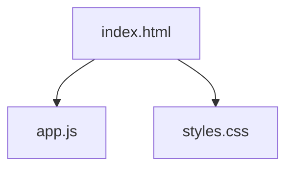

# 🧠 ThinkML

**Asistente Inteligente para Definir el Enfoque de Modelado**


---

**ThinkML** es una herramienta interactiva diseñada para ayudar a científicos de datos, analistas y estudiantes a identificar el enfoque correcto de machine learning **antes** de escribir una sola línea de código.

## 🚀 ¿Por qué existe?

> *"Un problema bien planteado es un problema medio resuelto."*

Muchos proyectos de ciencia de datos fallan no por la elección del algoritmo, sino por una **definición deficiente del problema**. ThinkML estructura el proceso de razonamiento crítico necesario para alinear los objetivos de negocio con la estrategia técnica.

## ✨ Características Principales

| Función | Descripción |
| :--- | :--- |
| 🎯 **Clarificación del Problema** | Identifica si necesitas regresión, clasificación, clustering, etc. |
| 🛠️ **Estrategia Recomendada** | Sugiere familias de modelos y métricas de evaluación específicas. |
| ⚠️ **Detección de Riesgos** | Señala posibles peligros (leakage, sobreajuste) antes de implementar. |
| ✅ **Próximos Pasos** | Genera una lista de verificación accionable y determinística. |

## 🚫 Qué NO es ThinkML

Es vital entender el alcance de esta herramienta para usarla correctamente:

- ❌ **No es AutoML**: No entrena modelos por ti.
- ❌ **No es un procesador de datos**: No se cargan datasets (CSV, Excel).
- ❌ **No es magia**: No reemplaza el criterio del experto, lo potencia.

*Esta herramienta organiza el pensamiento, no ejecuta el código.*

## 📂 Estructura del Proyecto

El proyecto es **100% Client-Side** (HTML/CSS/JS puro), lo que garantiza privacidad total y cero dependencias.



- `index.html`: Estructura semántica y contenido.
- `styles.css`: Diseño académico limpio y responsivo.
- `app.js`: Motor de diagnóstico y lógica de estado.

## 💻 Cómo Usar

1.  **Clonar el repositorio**:
    ```bash
    git clone https://github.com/GabArg/ThinKML.git
    ```
2.  **Abrir**: Haz doble clic en `index.html` en tu navegador favorito.
3.  **Navegar**: Sigue el asistente paso a paso para obtener tu diagnóstico.

## 🔗 Demo

[Ver Demo en Vivo](https://gabarg.github.io/ThinKML/) *(Enlace pendiente de configuración en GitHub Pages)*

---
Hecho con 💙 para la comunidad de Data Science.
