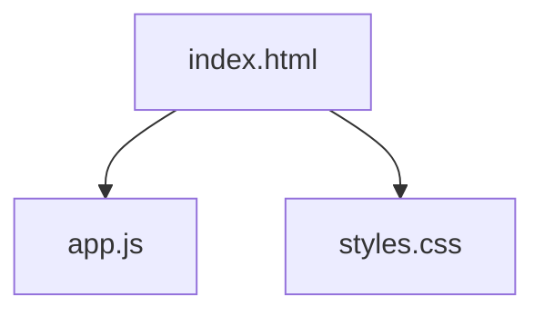

# ThinkML

**Asistente para definir el enfoque de modelado**

Herramienta orientada a estructurar decisiones de modelado en proyectos reales de datos.

## Demo en vivo
[Ver Demo (GitHub Pages)](https://gabarg.github.io/ThinKML/)

---

## Propósito

Muchos proyectos de machine learning fallan no por limitaciones algorítmicas, sino por una definición deficiente del problema. **ThinkML** estructura el razonamiento crítico necesario para alinear objetivos de negocio con la estrategia técnica adecuada.

Esta herramienta no ejecuta modelos; organiza el pensamiento previo a la implementación.

## Capacidades

| Función | Descripción |
| :--- | :--- |
| **Diagnóstico del Problema** | Clasifica la necesidad analítica (regresión, clasificación, series temporales, etc). |
| **Estrategia Técnica** | Sugiere familias de modelos y métricas de evaluación específicas para el caso. |
| **Análisis de Riesgos** | Detecta posibles puntos de fallo (estacionalidad, desbalance, leakage) antes de escribir código. |
| **Plan de Acción** | Genera una lista de verificación determinística para la etapa de implementación. |

## En qué contexto es útil

*   **Definición inicial de proyectos de datos**: Para alinear expectativas entre stakeholders y equipo técnico.
*   **Entrevistas técnicas**: Como marco de referencia para evaluar capacidad de planteo de problemas.
*   **Discusiones de estrategia analítica**: Para validar hipótesis antes de invertir recursos en desarrollo.
*   **Validación de enfoque antes de implementar**: Checklist de seguridad para evitar errores conceptuales costosos.

## Estructura del Proyecto

Arquitectura 100% Client-Side sin dependencias externas, garantizando privacidad y portabilidad.

- `app.js`: Motor de inferencia basado en reglas determinísticas.
- `index.html`: Estructura semántica y flujo de interfaz.
- `styles.css`: Sistema de diseño minimalista orientado a la legibilidad.

---

**ThinkML** — *Razonamiento estructurado para ciencia de datos.*
