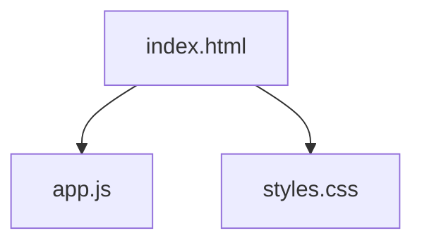

# ThinkML

**Asistente para definir el enfoque de modelado**

"La mayoría de los proyectos de Machine Learning fallan antes de comenzar: el problema está mal definido. ThinkML fue creado para estructurar esa etapa previa al modelado."

## Demo en vivo
[Ver Demo (GitHub Pages)](https://gabarg.github.io/ThinKML/)

---

## Propósito

ThinkML estructura el razonamiento crítico necesario para alinear objetivos de negocio con la estrategia técnica adecuada. No ejecuta modelos; organiza el planteo del problema antes de la implementación.

## Enfoque

El sistema utiliza reglas deterministas para mapear características del problema a estrategias de modelado, evaluación y validación.

## Capacidades

| Función | Descripción |
| :--- | :--- |
| **Diagnóstico del Problema** | Clasifica la necesidad analítica (regresión, clasificación, series temporales, etc). |
| **Estrategia Técnica** | Sugiere familias de modelos y métricas de evaluación específicas para el caso. |
| **Análisis de Riesgos** | Detecta posibles puntos de fallo (estacionalidad, desbalance, leakage) antes de escribir código. |
| **Plan de Acción** | Genera una lista de verificación determinística para la etapa de implementación. |

## Contexto profesional

*   Definición inicial de alcance del modelo
*   Selección de métricas adecuadas
*   Discusión técnica previa con stakeholders
*   Preparación para entrevistas técnicas

## Qué NO es ThinkML

Es fundamental entender el alcance de la herramienta:

- No es AutoML
- No carga datasets
- No entrena modelos
- **No reemplaza criterio profesional**

## Estructura del Proyecto

Arquitectura 100% Client-Side sin dependencias externas, garantizando privacidad y portabilidad.

- `app.js`: Motor de inferencia basado en reglas determinísticas.
- `index.html`: Estructura semántica y flujo de interfaz.
- `styles.css`: Sistema de diseño minimalista orientado a la legibilidad.

---

**ThinkML** — *Razonamiento estructurado para ciencia de datos.*
